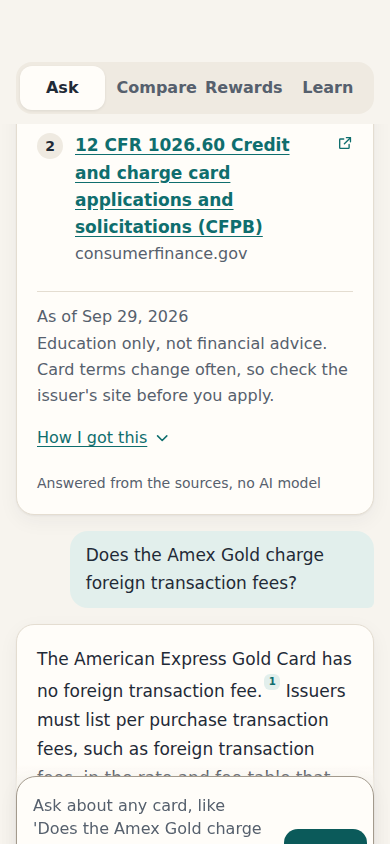
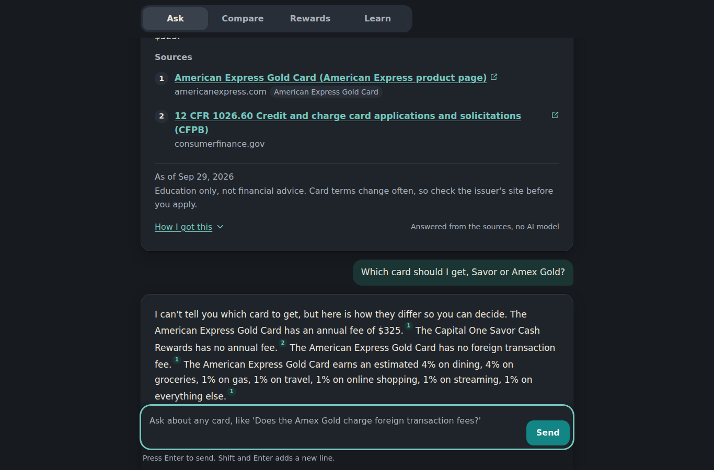
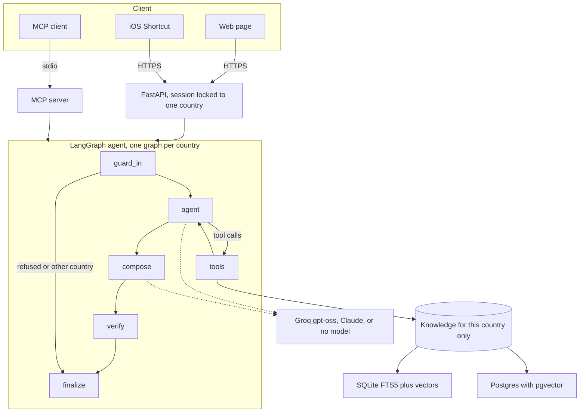

# CardPilot

Understand any credit card in your country. Ask in plain words and every sentence of the answer
points to the page it came from. Pick the United States or India once, and CardPilot stays inside
that country's cards and rules.

CardPilot explains and compares. It never tells anyone which card to get.

<p>


</p>

## What it does

- **Ask** a question about a card or about how cards work, and get 2 to 5 cited sentences with the sources listed underneath
- **Ask about every card at once**, like every card's APR or which cards have no annual fee, and get one cited line per card
- **Follow-ups** like "what is its APR?" or "are these the top cards?" work, because each session keeps its last three turns
- **Compare** two or three cards side by side, every cell linked to its source
- **Rewards** estimates yearly rewards from monthly spending, with plain arithmetic you can check
- **Learn** gives short lessons built only from the regulator's pages (CFPB and FTC for the US, RBI for India)
- **Wallet tap** on iPhone shows what each of your cards earns at the shop you are standing in ([guide](shortcuts/README.md))
- **MCP server** exposes the same tools to Claude Desktop, Claude Code, Cursor or any MCP client

## How it works



Each question runs through a fixed LangGraph state machine. The model only works inside it.

1. **guard_in** adds the session's last three turns so follow-ups make sense, and removes card numbers (checked with the Luhn formula), SSN, Aadhaar, PAN, CVV and expiry dates before anything is logged or sent to a model. It refuses prompt injection and topics outside cards, and it refuses a card from the other country.
2. **agent** lets the model pick tools (`search_docs`, `get_card`, `compare_cards`, `list_cards`, `estimate_rewards`). If the model answers from memory without a tool, the graph makes it search first. Tool calls are capped per question.
3. **tools** run the calls and give every piece of evidence an id like `E3`.
4. **compose** asks the model for a `CitedAnswer`, a typed structure where each sentence lists its evidence ids.
5. **verify** drops any sentence that cites an id that does not exist, or states a number the cited evidence does not contain.
6. **finalize** removes advice and ranking wording ("you should get", "most popular card"), numbers the sources, and adds the date and disclaimer. A question about top or best cards gets a note that CardPilot doesn't rank cards, followed by the facts card by card.

If the model is down, rate limited or slow, the same graph answers with extracted, cited facts and
says which engine answered. The whole trace (steps, tools, timings) is returned with every answer
and shown under "How I got this".

### Country isolation

Isolation is built into the structure, not left to a prompt.

- Each country has its own index (its own SQLite file, or its own Postgres schema) and the search methods take no country argument
- The store refuses to index a chunk from another country
- A session picks its country once, and every endpoint reads the country from the session, never from the request
- The MCP tools take the country as an enum and there is no tool that searches both
- Tests and evals ask each country about the other country's cards and check that nothing leaks

### Search

Hybrid retrieval fuses keyword search (SQLite FTS5 with BM25, or Postgres full text) with vector
search using reciprocal rank fusion. On Postgres the fusion happens inside one SQL query with an
HNSW index. Embeddings default to a small GloVe model that ships inside the package, so nothing is
downloaded. `bge-small-en-v1.5` is available as an option.

### Models

| Engine | When | Notes |
|---|---|---|
| Groq `openai/gpt-oss-120b` | `GROQ_API_KEY` is set | Free tier. Falls back to `gpt-oss-20b`, then to offline |
| Claude `claude-haiku-4-5` | `ANTHROPIC_API_KEY` is set and no Groq key, or `CARDPILOT_ENGINE=claude` | Pay per use |
| Offline | No key | Extracted, cited facts. Also the fallback when a model fails |

## Evaluation

`uv run python evals/run.py` scores retrieval and the whole agent against frozen question sets, and
CI fails the build if a score drops below its threshold. Latest offline results are in
[evals/results.md](evals/results.md).

| Offline engine | US | India |
|---|---|---|
| Retrieval hit@5, hybrid | 97% | 100% |
| Retrieval hit@5, hybrid, held-out questions | 80% | 70% |
| Fee and foreign-fee answers with the right value | 100% | 100% |
| Answers where every sentence is cited | 100% | 100% |
| Other country's cards refused | 100% | 100% |
| Card and ID numbers removed | 100% | 100% |
| Prompt injections and off-topic questions refused | 100% | 100% |
| "Which card should I get" answered without a pick | 100% | 100% |
| Questions about every card that name every card | 100% | 100% |
| "Top" or "best" cards answered without a ranking | 100% | 100% |

**What the evals caught.** The first run scored 39% (US) and 47% (India) on fee questions, because
people say "cost per year" while card pages say "annual fee". A small domain vocabulary
([vocab.py](src/cardpilot/vocab.py)) fixed that, and US hybrid hit@5 went from 73% to 97%. A
held-out set, written before the fix and never tuned against, barely moved (US 80% to 80%, India
70% to 70%, and US MRR dipped from 0.76 to 0.68). So the rules fit the questions they were built from and do not generalise much. The
real fix for paraphrases is a stronger embedder or the model path, and both are measurable with
the same command.

```bash
uv run python evals/run.py                                   # offline, the CI gate
uv run python evals/run.py --engine groq --limit 30 --pace 2 # the model path, paced for the free tier
CARDPILOT_EMBEDDER=bge-small uv run python evals/run.py      # after uv sync --extra embeddings
```

## Run it

Needs [uv](https://docs.astral.sh/uv/). It fetches Python 3.11 for the project by itself, because `.python-version` pins it to match CI and Docker.

```bash
uv sync
cp .env.example .env              # the dot matters. Then put your Groq key in .env (optional)
uv run cardpilot-ingest           # builds the search index for both countries
uv run uvicorn cardpilot.api:app  # open http://localhost:8000
```

With Docker.

```bash
docker compose up                     # SQLite, on http://localhost:8000
docker compose --profile postgres up  # Postgres with pgvector, on http://localhost:8001
```

### Put it online

`render.yaml` deploys CardPilot to [Render](https://render.com) on the free plan, from the Dockerfile.

1. Sign in to Render with GitHub
2. Choose **New**, then **Blueprint**, and pick this repository
3. Paste a Groq key when Render asks for `GROQ_API_KEY`, or leave it empty to run with no model
4. Press **Apply**. The first build takes a few minutes, and every push to `master` deploys again

The free plan sleeps after 15 minutes without visitors, and the next visit takes about a minute to wake it. Sessions live in memory, so they reset when it sleeps.

To use it as an MCP server, add this to Claude Desktop's config, with the full path to the project.

```json
{
  "mcpServers": {
    "cardpilot": {
      "command": "uv",
      "args": ["--directory", "/path/to/CardPilot", "run", "cardpilot-mcp"]
    }
  }
}
```

The tools are `search_card_docs`, `get_card`, `list_cards`, `compare_cards`, `estimate_rewards`,
and `ask_cardpilot` (the whole agent as one tool). All are marked read-only.

## API

| Method | Path | What it does |
|---|---|---|
| POST | `/api/session` | Start a session for `us` or `in` |
| GET | `/api/suggestions` | Sample questions for the session's country |
| POST | `/api/ask` | One question through the agent, with sources and trace |
| GET | `/api/cards` | Card list and spending categories |
| POST | `/api/compare` | Side-by-side table for two or three cards |
| POST | `/api/estimate` | Yearly rewards from monthly spending |
| GET | `/api/lessons` | Lessons from the regulator's pages |
| GET | `/api/tap` | Plain text for the Wallet Shortcut |
| GET | `/healthz` | Engine, index sizes, data date |
| GET | `/metrics` | Prometheus counters |
| GET | `/docs` | OpenAPI docs |

POST requests need an `X-CardPilot-Client` header, which blocks forged cross-site form posts.
Requests are rate limited per client, responses carry a request id and security headers, and the
logs record route, status and time but never the question.

## Observability

- Every answer returns its trace, and the page shows it under "How I got this"
- Langfuse traces every node, tool call and model call when `LANGFUSE_PUBLIC_KEY` and `LANGFUSE_SECRET_KEY` are set (`uv sync --extra tracing`)
- LangSmith works with `LANGSMITH_TRACING=true` and `LANGSMITH_API_KEY`, no code change
- `/metrics` counts requests, answers by engine and refusals, and answer latency

## Tests

```bash
uv run pytest -q
```

162 tests, all offline. They cover the guards, the catalog, retrieval in all three modes, country
isolation, the offline graph, questions about every card, follow-ups, the model graph with scripted fake models (tool use, dropped
unsupported sentences, advice removal, outage fallback, tool call cap, a card number never
reaching the model), the API, the MCP tools, and the Postgres store on a real Postgres with
pgvector started inside the test run.

## Project layout

```
src/cardpilot/
  api.py          FastAPI app, sessions, rate limits, metrics, Wallet tap
  graph.py        the LangGraph agent
  tools.py        the five tools and their schemas
  llm.py          model gateway with retries and fallback
  guards.py       redaction, injection and topic checks, advice filter
  retrieval.py    index building and hybrid search
  store.py        SQLite and Postgres stores, one per country
  embeddings.py   GloVe (bundled) and bge-small
  vocab.py        everyday words mapped to card document words
  catalog.py      card data, comparisons and estimates
  lessons.py      lessons from regulator pages
  mcp_server.py   MCP server
data/cards/       us.json and in.json, every fact with its source URL
web/index.html    the whole web app in one file
evals/            golden sets, held-out sets, runner, results
shortcuts/        the iPhone Wallet guide
```

## Status and limits

- Card data is a snapshot taken on 2026-09-29. Card terms change often, so each answer shows that date
- A few values could only be confirmed on secondary sites, and some earn rates are not published. Those show as "not published" instead of a guess. See `notes` in the card files
- The model path is tested with scripted fake models. It has not yet been scored with the eval suite against live Groq or Claude
- The bge-small embedder is wired in but not yet scored. It downloads on first use, which the build machine for this release could not do
- Sessions live in memory, which is right for one server. Several servers would need Redis
- The Docker image is built and smoke tested in CI

## Credits and data

Code by Sai Nagesh Gowra Balaji. Data sources and the GloVe license are listed in [NOTICE](NOTICE).
Education only, not financial advice.
